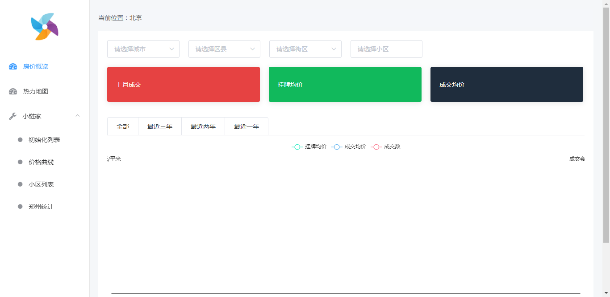
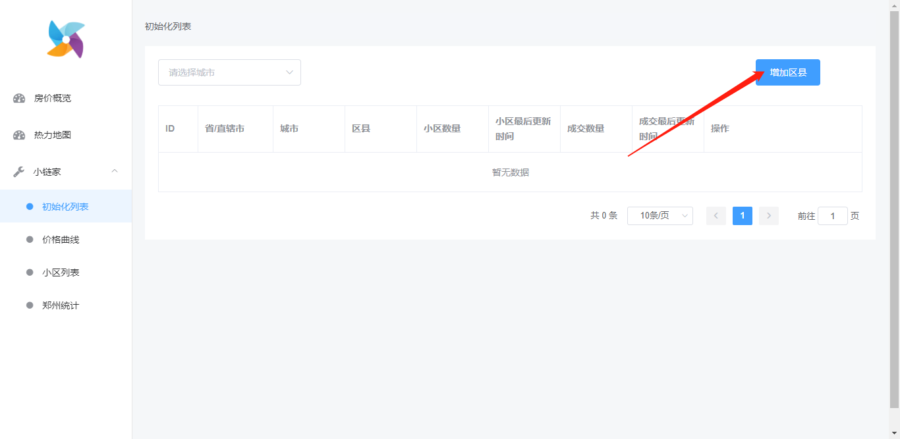
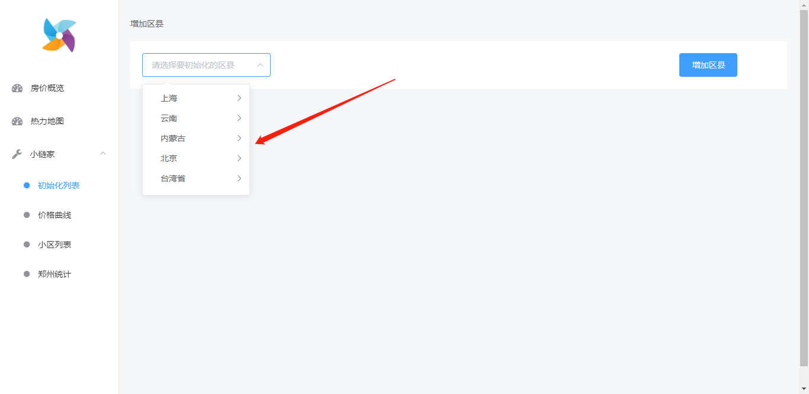
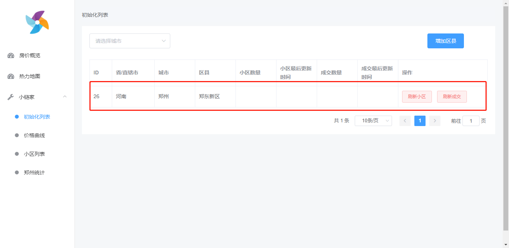
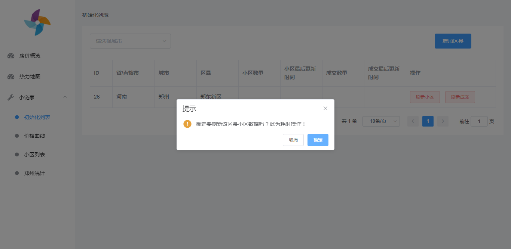
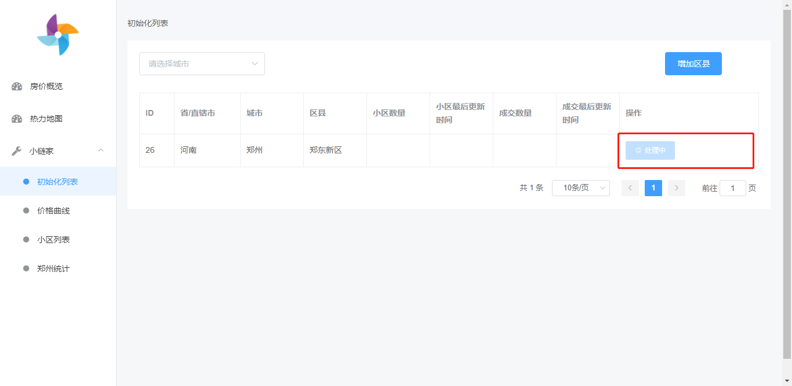
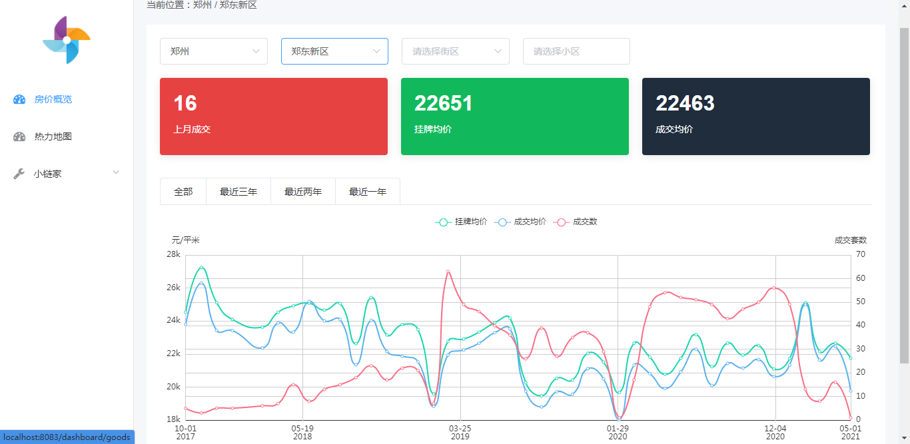

# 小链家

## 项目特点

* 部署简单，只需执行几个初始化sql，配置下数据库，启动项目即可通过web页面开始抓取你感兴趣地区的房价数据；

* 数据通过echarts图表展示，历史价格一目了然；

* 体验网址：[小链家](http://house.fengxiuge.top)

* 体验账号：xhh  体验密码：123789

## 部署步骤
0. 克隆本项目到本地
   git clone https://github.com/yakunyue/house-viewer

1. 创建mysql数据库
   
   创建一个名称为 house-db 的 mysql 数据库；
   把 resources/application.yaml 配置文件中的数据库用户名和密码修改问你自己的数据库用户名和密码；
   
2. 初始化数据库
   
   打开上一步创建的 house-db 数据库；
   导入 resources/sql/init_region.sql；
   导入 resources/sql/init_table.sql；
   
3. 启动项目
   
* 访问：http://localhost:8083，即可看到如下页面：

4. 初始化自己关心的区县数据 
   
* 点击左侧导航栏 小链家》初始化列表，点击右上角的增加区县按钮；

* 点击选择框，选择想要初始化的区县；

* 以河南省 郑州市 郑东新区为例，选完后点击右上角的增加区县按钮；

* 此时，初始化列表页面即可看到刚刚增加的条目；

5. 开始抓取小区数据和成交数据

* 点击条目右侧的刷新小区按钮，开始抓取小区数据；

  
* 抓取数据是耗时操作，一般一个区需要5-15分钟不等；
为了避免并发太高被链家封ip，所有抓取操作都采用单线程执行，并且后台进行了同步操作，必须一个处理完才能开始处理下一个。

  
* 等小区数据抓取结束即可点击 刷新成交 按钮开始抓取成交记录；

6. 查看数据
**房价概览** 和 **小链家》价格曲线** 页面都可以查看数据。

## 成交热力图功能

*待完善*

